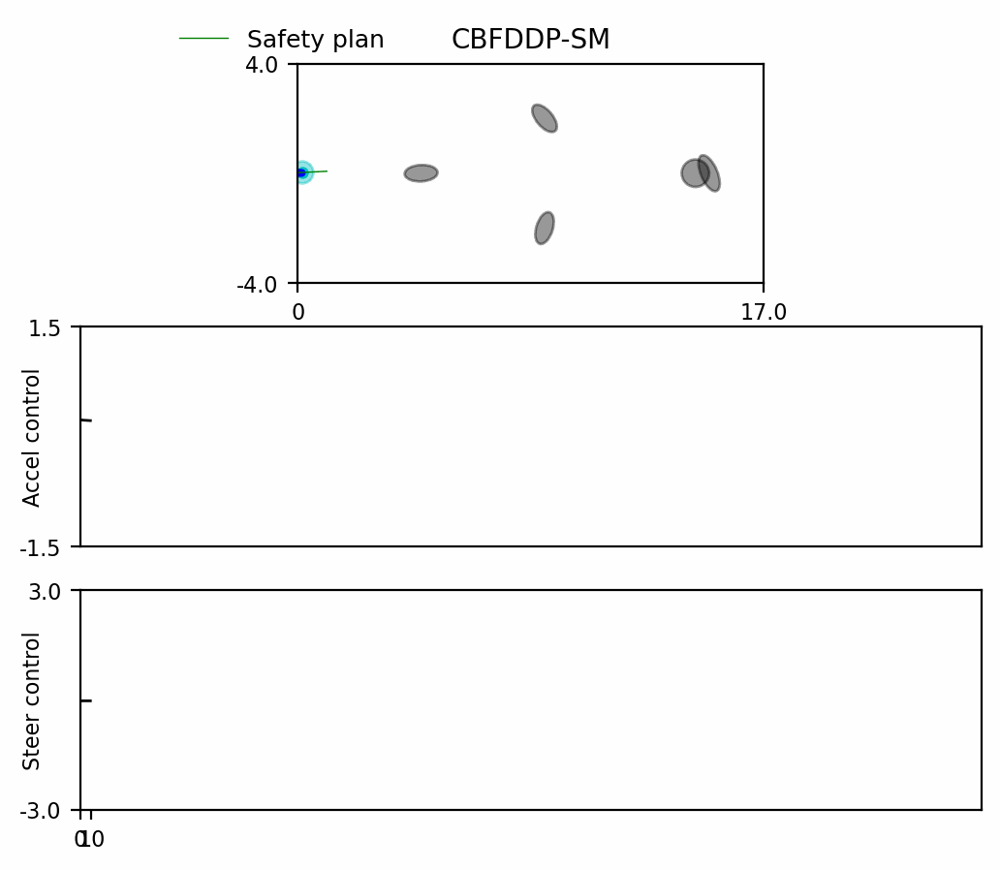
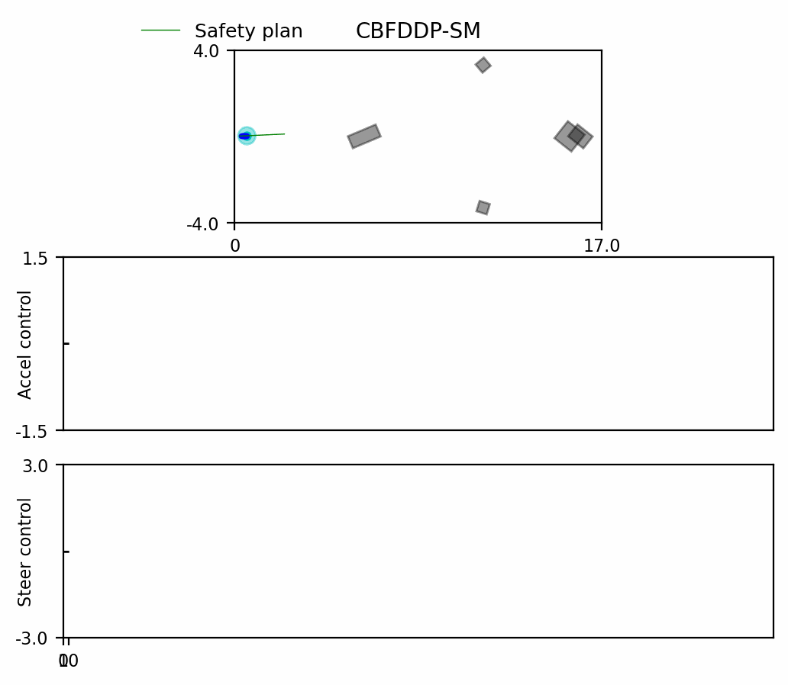
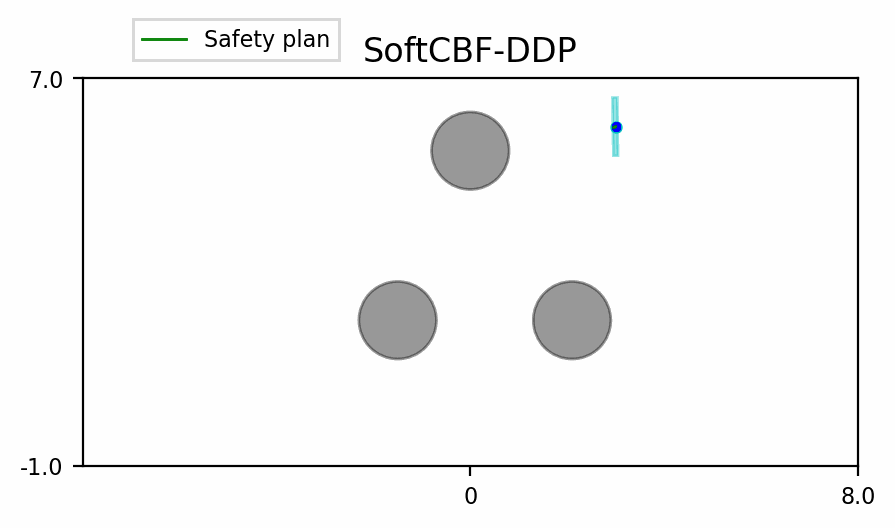

# Soft-DDPCBF

This is a repository for using CBF-DDP with soft minimum and maximum operators in place of the hard operators that were originally used. All changes are contained in the main branch. For public release, the code will go through another iteration of cleaning.

### Reachability Rollout with CBFDDP-SM on the Bicycle 5D dynamics.

### Reach-avoid Rollout with CBFDDP-SM on the Bicycle 5D dynamics.

### Reachability Rollout with CBFDDP-SM on the PVTOL 6D dynamics.

TODO:
- Look at other means of obtaining target functions such as using a learned target function for better reach-avoid results - 

### Brax testing

- Reacher produces meaningful results.
- Ant does something but not entirely meaningful.
- Barkour does something meaningful with reachability LR-DDP and CBF-DDP. The reach-avoid deserves more rigorous margin construction. Enabling noise requires more careful
  coding.

